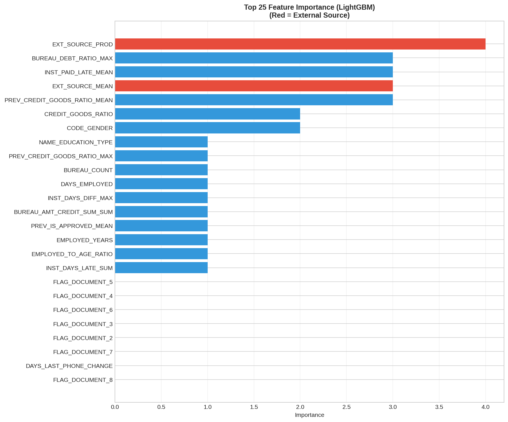
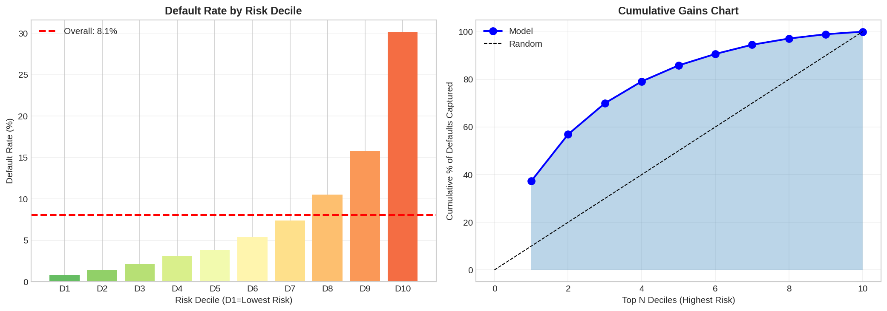
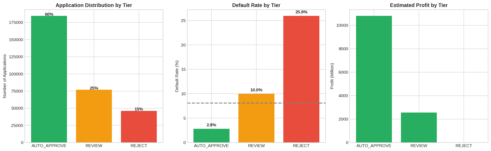

# 🏦 Home Credit Default Risk Prediction


> **Membangun Model Machine Learning untuk Meminimalkan Kerugian Kredit Macet dan Meningkatkan Profit hingga 43.7%**

## 📋 Table of Contents

- [Overview](#-overview)
- [Problem Statement](#-problem-statement)
- [Dataset](#-dataset)
- [Key Insights](#-key-insights)
- [Methodology](#-methodology)
- [Model Performance](#-model-performance)
- [Business Implementation](#-business-implementation)
- [Project Structure](#-project-structure)
- [Installation & Usage](#-installation--usage)
- [Results & Visualizations](#-results--visualizations)
- [Future Improvements](#-future-improvements)
- [References](#-references)
- [Author](#-author)

---

## 🎯 Overview

This project develops a **credit risk prediction model** for Home Credit, a financial institution that provides loans to the "unbanked" population - individuals with little or no credit history. The model predicts the probability of loan default, enabling automated decision-making that increases profit by **43.7%** while maintaining a **90.1% approval rate**.

### Key Achievements

| Metric | Value |
|--------|-------|
| Best Model | XGBoost |
| ROC-AUC Score | **0.7889** |
| PR-AUC Score | 0.2816 |
| Profit Improvement | **+$4.06 Billion (+43.7%)** |
| Auto-Approval Rate | 60% of applications |
| Default Capture (Top 10%) | 37% of all defaults |

---

## ❓ Problem Statement

### The Challenge

Home Credit faces a critical business challenge: **How to provide loans to individuals without traditional credit history while minimizing default risk?**

### Current Situation

- **8.07%** of loan applications result in default (24,825 out of 307,511)
- Each default causes **40-80% loss** of the loan value
- Manual review process is **slow, inconsistent, and expensive**
- Risk of rejecting potentially good customers (opportunity loss)

### Project Objectives

1. Build a predictive model to identify high-risk applications automatically
2. Implement a 3-tier decision system (Auto-Approve, Review, Reject)
3. Increase profit while maintaining acceptable approval rates
4. Provide actionable insights for business strategy

---

## 📊 Dataset

### Source
[Kaggle - Home Credit Default Risk Competition](https://www.kaggle.com/c/home-credit-default-risk)

### Scale

| Dataset | Records | Description |
|---------|---------|-------------|
| application_train | 307,511 | Main application data (training) |
| application_test | 48,744 | Main application data (testing) |
| bureau | 1,716,428 | Credit history from other institutions |
| bureau_balance | 27,299,925 | Monthly bureau credit data |
| previous_application | 1,670,214 | Previous Home Credit applications |
| installments_payments | 13,605,401 | Payment history for previous credits |
| POS_CASH_balance | 10,001,358 | POS and cash loan balance |
| credit_card_balance | 3,840,312 | Credit card balance data |

### Target Variable Distribution

```
Good Loans (No Default): 91.93% (282,686 applications)
Default:                  8.07%  (24,825 applications)
```

⚠️ **Highly Imbalanced Dataset** - Required special handling techniques

---

## 💡 Key Insights

### Insight #1: External Source Score is the Strongest Predictor

External Source Scores from credit bureaus show the most significant predictive power:

| External Source Score | Default Rate | Risk Level |
|-----------------------|--------------|------------|
| Low (< 0.3) | **23.14%** | 🔴 High Risk |
| Medium (0.3 - 0.6) | ~8% | 🟡 Medium Risk |
| High (> 0.6) | **2.92%** | 🟢 Low Risk |

**Gap: 20.2 percentage points** - Customers with low scores have **8x higher default risk!**

#### Recommended Actions:
- ✅ **Fast-track approval** for scores > 0.6 (24-hour approval, competitive rates)
- ✅ **Enhanced due diligence** for scores < 0.3 (additional documents, collateral required)
- ✅ **Invest in data partnerships** with credit bureaus for better coverage

---

### Insight #2: Demographics Significantly Impact Default Risk

#### Age Analysis
| Age Group | Default Rate | Insight |
|-----------|--------------|---------|
| 18-25 years | **12.3%** | Highest risk |
| 26-35 years | 10.7% | High risk |
| 56-65 years | **3.7%** | Lowest risk |

Young borrowers (< 30) are **2x more likely to default** than mature borrowers.

#### Income Type Analysis
| Income Type | Default Rate | Volume |
|-------------|--------------|--------|
| Working (Private) | 9.6% | 158,774 |
| State Servant (PNS) | **5.8%** | 21,703 |
| Pensioner | **5.4%** | 55,362 |

**State servants and pensioners are the SAFEST segments!**

#### Occupation Analysis
| High Risk (>10%) | Low Risk (<7%) |
|------------------|----------------|
| Drivers: 11.3% | Accountants: 4.8% |
| Security Staff: 10.7% | Managers: 6.2% |
| Laborers: 10.6% | High-skill Tech: 6.2% |

#### Recommended Actions:
- ✅ **Launch "Pensioner Loan"** campaign targeting retirees (5.4% default rate)
- ✅ **Create "Professional Loan"** for accountants, managers, tech workers
- ✅ **Risk-based pricing**: Premium rates for high-risk segments, discounts for low-risk
- ✅ **Additional requirements** for young borrowers (< 30): co-signer/guarantor

---

## 🔬 Methodology

### 1. Data Preprocessing

```python
# Key preprocessing steps
- Missing value handling with flag indicators
- Anomaly treatment (DAYS_EMPLOYED = 365243 → pensioner/unemployed)
- Outlier capping at 99th percentile (income, credit amount)
- Binary encoding for categorical variables
- Label encoding for 13 categorical features
```

### 2. Feature Engineering

Created **294 features** from 7 data sources:

| Category | Examples | Count |
|----------|----------|-------|
| External Sources | EXT_SOURCE_PROD, EXT_SOURCE_MEAN, EXT_SOURCE_WEIGHTED | 15 |
| Payment History | INST_PAID_LATE_MEAN, BUREAU_DEBT_RATIO_MAX | 35 |
| Financial Ratios | CREDIT_GOODS_RATIO, CREDIT_INCOME_RATIO, PAYMENT_BURDEN | 20 |
| Demographics | AGE_YEARS, EMPLOYED_YEARS, EMPLOYED_TO_AGE_RATIO | 15 |
| Bureau Aggregation | BUREAU_COUNT, BUREAU_AMT_CREDIT_SUM, BUREAU_ACTIVE_COUNT | 48 |
| Previous Applications | PREV_APPROVAL_RATE, PREV_REFUSAL_RATE | 36 |
| Installments | INST_DAYS_LATE_SUM, INST_PAYMENT_RATIO_MEAN | 23 |

### 3. Handling Imbalanced Data

```python
# Techniques used
- Scale_pos_weight = 11.39 (class ratio)
- Stratified 5-Fold Cross Validation
- PR-AUC as secondary metric (better for imbalanced data)
```

### 4. Models Trained

| Model | Configuration |
|-------|---------------|
| **XGBoost** | max_depth=5, n_estimators=1500, learning_rate=0.05 |
| LightGBM | max_depth=6, n_estimators=1500, num_leaves=31 |
| Logistic Regression | C=0.1, penalty='l2', class_weight='balanced' |
| Ensemble | Simple average of all models |

---

## 📈 Model Performance

### Model Comparison

| Model | ROC-AUC | PR-AUC | Status |
|-------|---------|--------|--------|
| **XGBoost** | **0.7889** | **0.2816** | ✅ Best Model |
| Ensemble | 0.7804 | 0.2688 | Runner-up |
| Logistic Regression | 0.7497 | 0.2250 | Baseline |
| LightGBM | 0.7294 | 0.1934 | - |

### Cross-Validation Results (XGBoost)

```
Fold 1: AUC = 0.7856, Iterations = 627
Fold 2: AUC = 0.7934, Iterations = 705
Fold 3: AUC = 0.7870, Iterations = 589
Fold 4: AUC = 0.7937, Iterations = 814
Fold 5: AUC = 0.7850, Iterations = 878
─────────────────────────────────────
TOTAL:  AUC = 0.7889
```

### Risk Segmentation Performance

| Decile | Default Rate | Cumulative Capture |
|--------|--------------|-------------------|
| D1 (Safest) | ~1% | - |
| D2 | ~1.5% | - |
| D3 | ~2% | - |
| D5 | ~5% | 57% |
| D8 | ~11% | 85% |
| D10 (Riskiest) | **~30%** | 100% |

**Key Achievement**: Top 10% riskiest applications capture **37% of all defaults**

### Top 10 Most Important Features

1. `EXT_SOURCE_PROD` - Product of external source scores
2. `BUREAU_DEBT_RATIO_MAX` - Maximum debt ratio from bureau
3. `INST_PAID_LATE_MEAN` - Average late payment rate
4. `EXT_SOURCE_MEAN` - Average external source score
5. `PREV_CREDIT_GOODS_RATIO_MEAN` - Previous credit to goods ratio
6. `CREDIT_GOODS_RATIO` - Current credit to goods ratio
7. `CODE_GENDER` - Gender
8. `NAME_EDUCATION_TYPE` - Education level
9. `PREV_CREDIT_GOODS_RATIO_MAX` - Max previous credit ratio
10. `BUREAU_COUNT` - Number of bureau records

---

## 💼 Business Implementation

### 3-Tier Decision System

| Tier | Score Range | Volume | Default Rate | Action |
|------|-------------|--------|--------------|--------|
| 🟢 **AUTO-APPROVE** | < 0.39 | 60% (184,507) | 2.81% | Approve within 24 hours |
| 🟡 **REVIEW** | 0.39 - 0.64 | 25% (76,877) | 9.99% | Manual credit analyst review |
| 🔴 **REJECT** | ≥ 0.64 | 15% (46,127) | 25.94% | Automatic rejection |

### Financial Impact

| Metric | Value |
|--------|-------|
| Baseline Profit (Approve All) | $9.29 Billion |
| Profit with Model | $13.35 Billion |
| **Net Benefit** | **+$4.06 Billion** |
| **Improvement** | **+43.7%** |

### Business Benefits

- ✅ **60% auto-approval** → Faster customer experience, reduced operational cost
- ✅ **15% auto-rejection** → Avoid high-risk loans automatically
- ✅ **Analysts focus on 25%** "grey area" → Better decision quality
- ✅ **43.7% profit increase** → Significant value creation

---

## 📁 Project Structure

```
home-credit-default-risk/
│
├── 📓 notebooks/
│   └── home_credit_analysis.ipynb    # Main analysis notebook
│
├── 📊 visualizations/
│   ├── 01_model_performance.png      # ROC & PR curves
│   ├── 02_feature_importance.png     # Feature importance chart
│   ├── 02_demographics_basic.png     # Demographic analysis
│   ├── 02_demographics_advanced.png  # Advanced demographics
│   ├── 03_risk_deciles.png           # Risk decile analysis
│   ├── 04_three_tier_policy.png      # 3-tier policy visualization
│   └── 05_executive_dashboard.png    # Executive summary dashboard
│
├── 📄 outputs/
│   ├── submission.csv                # Kaggle submission file
│   ├── feature_importance.csv        # Feature importance data
│   ├── risk_deciles.csv              # Risk decile statistics
│   ├── tier_stats.csv                # 3-tier policy statistics
│   └── model_config.json             # Model configuration
│
├── 📋 README.md                      # This file
└── 📋 requirements.txt               # Python dependencies
```

---

## 🚀 Installation & Usage

### Prerequisites

- Python 3.8+
- 8GB+ RAM recommended
- Google Colab (optional, for GPU acceleration)

### Installation

```bash
# Clone the repository
git clone https://github.com/ClarisyaA/RakaminHomeCredit.git
cd RakaminHomeCredit

# Create virtual environment
python -m venv venv
source venv/bin/activate  # Linux/Mac
# or
venv\Scripts\activate     # Windows

# Install dependencies
pip install -r requirements.txt
```

### Requirements

```txt
numpy>=1.21.0
pandas>=1.3.0
matplotlib>=3.4.0
seaborn>=0.11.0
scikit-learn>=1.0.0
lightgbm>=3.3.0
xgboost>=1.7.0
```

### Usage

```python
# 1. Download data from Kaggle
# https://www.kaggle.com/c/home-credit-default-risk/data

# 2. Update data path in CONFIG
CONFIG = {
    'DATA_PATH': '/path/to/your/data/',
    ...
}

# 3. Run the notebook
jupyter notebook notebooks/home_credit_analysis.ipynb

# Or run in Google Colab
# Upload notebook and mount Google Drive with data
```

### Quick Start (Google Colab)

```python
# Mount Google Drive
from google.colab import drive
drive.mount('/content/drive')

# Set data path
CONFIG['DATA_PATH'] = '/content/drive/MyDrive/your-data-folder/'

# Run all cells
```

---

## 📊 Results & Visualizations

### Model Performance Curves


*ROC curves, Precision-Recall curves, and score distribution for all models*

### Feature Importance



*Top 25 most important features (Red = External Source features)*

### Risk Decile Analysis



*Default rate by risk decile and cumulative gains chart*

### 3-Tier Policy



*Application distribution, default rate, and profit by tier*

### Executive Dashboard


*Complete executive summary with all key metrics*

---

## 🔮 Future Improvements

### Model Enhancements
- [ ] Implement **CatBoost** for better categorical handling
- [ ] Try **Neural Networks** (TabNet, DeepFM)
- [ ] **Hyperparameter tuning** with Optuna/Hyperopt
- [ ] **Feature selection** using SHAP values

### Business Enhancements
- [ ] **A/B testing** framework for threshold optimization
- [ ] **Real-time scoring API** deployment
- [ ] **Model monitoring** dashboard for drift detection
- [ ] **Segment-specific models** for different customer types

### Data Enhancements
- [ ] Incorporate **alternative data** (mobile, social)
- [ ] **Time-series features** from payment history
- [ ] **Graph features** from social network data

---

## 📚 References

### Dataset
- [Kaggle Home Credit Default Risk Competition](https://www.kaggle.com/c/home-credit-default-risk)

### Methodology & Algorithms
- Chen, T., & Guestrin, C. (2016). *XGBoost: A Scalable Tree Boosting System*. KDD '16.
- Ke, G., et al. (2017). *LightGBM: A Highly Efficient Gradient Boosting Decision Tree*. NIPS '17.

### Domain Knowledge
- Home Credit Group - [Official Website](https://www.homecredit.net/)
- Basel Committee on Banking Supervision - Credit Risk Management Guidelines

### Tools & Libraries
- [Scikit-learn](https://scikit-learn.org/)
- [XGBoost](https://xgboost.readthedocs.io/)
- [LightGBM](https://lightgbm.readthedocs.io/)
- [Pandas](https://pandas.pydata.org/)
- [Matplotlib](https://matplotlib.org/) & [Seaborn](https://seaborn.pydata.org/)

---

## 👤 Author

**[Your Name]**

- GitHub: [@ClarisyaA](https://github.com/ClarisyaA)
- LinkedIn: [clarisyaadeline](https://linkedin.com/in/clarisyaadeline)
- Email: adelineclarisya@gmsil.com

## 🙏 Acknowledgments

- **Home Credit** for making this real-world problem available
- **Rakamin Academy** for the learning opportunity

---